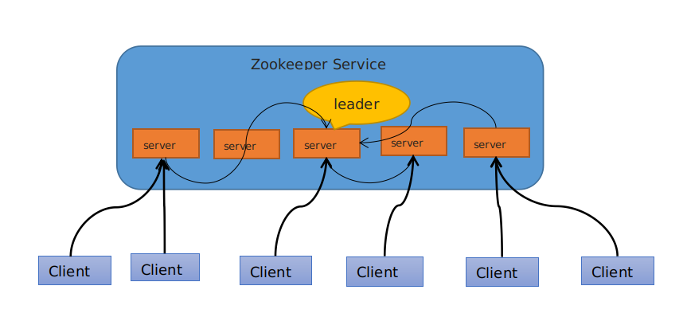
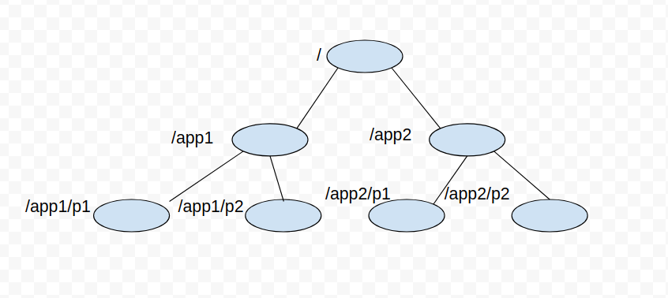
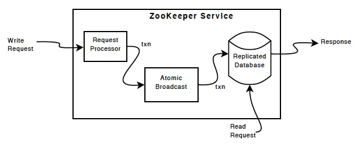

## Zk 介绍

>  Zookeeper 最早起源于雅虎研究院的一个研究小组。在当时，研究人员发现，在雅虎内部很多大型系统基本都需要依赖一个类似的系统来进行分布式协调，但是这些系统往往都存在分布式单点问题。所以，雅虎的开发人员就试图开发一个通用的无单点问题的分布式协调框架，以便让开发人员将精力集中在处理业务逻辑上。
>  关于“ZooKeeper”这个项目的名字，其实也有一段趣闻。在立项初期，考虑到之前内部很多项目都是使用动物的名字来命名的（例如著名的Pig项目),雅虎的工程师希望给这个项目也取一个动物的名字。时任研究院的首席科学家 RaghuRamakrishnan 开玩笑地说：“在这样下去，我们这儿就变成动物园了！”此话一出，大家纷纷表示就叫动物园管理员吧一一一因为各个以动物命名的分布式组件放在一起，雅虎的整个分布式系统看上去就像一个大型的动物园了，而 Zookeeper 正好要用来进行分布式环境的协调一一于是，Zookeeper 的名字也就由此诞生了。  
(摘自 [《从Paxos到Zookeeper》](《从Paxos到Zookeeper》))

### Zk: A Distributed Coordination Service for Distributed Applications

这个是官方的标题，Zk 是一个分布式应用程序的分布式协调服务，用于管理大型主机，并且开源。在分布式环境中协调和管理服务是一个复杂的过程。ZooKeeper通过其简单的架构和API解决了这个问题。ZooKeeper允许开发人员专注于核心应用程序逻辑，而不必担心应用程序的分布式特性。

众所周知，协调服务是很难实现的，因为很容易导致竞争和死锁。而Zk背后的动机就是减轻分布式应用程序从头开始实现协调服务的责任。

### 设计目标

`Zookeeper` 非常简单。ZooKeeper允许分布式进程通过一个共享的跟标准文件系统相似的架构的层级命名空间来互相调度。命名空间包含称为znodes的数据寄存器（在ZooKeeper的说法中），这些类似于文件和目录。不像传统的文件系统被设计用于存储，ZooKeeper数据是保存在内存中，那就意味着ZooKeeper能够获得高吞吐量和低延迟。并且Zk非常重视高性能、高可用、顺序访问，Zk的性能方面意味着它可以被用于大型的分布式应用，可靠性方面会让Zk不存在单点故障，顺序访问意味着在客户端可以使用同步语句进行访问。

`Zookeeper` 是可以被复制的。和它协调的分布式应用一样，Zk可以在多个服务器之间建立集群，并复制数据。

组成Zk集群的服务器必须要能相互通信，它们在内存中保存一份状态、以及持久性存储中的事务日志和快照。Zk只要大多数服务可以(n/2 + 1, 这也是为什么Zk集群推荐奇数个节点)，则集群就可用。

`Zookeeper` 是有序的。ZooKeeper用一个数字来记录每个反映所有ZooKeeper事务的顺序。后续的操作可以使用顺序来实现高水平的抽象，例如同步原语。

`Zookeeper` 非常快。尤其是在读取性能特性明显。ZooKeeper应用运行在成千台机器上，并且它在读取上比写入表现得更好，比率大概为10:1。

### 数据模型和分层命名空间

Zk提供的命名空间非常类似与标准的文件系统。命名是以斜杠(/)分隔的路径元素序列，Zk命名空间中每一个节点都是由路径标识。

Zk命名空间示意:

### 节点和临时节点

与标准文件系统不同，Zk命名空间中每个节点都可以包含与之关联的数据和孩子节点有关的数据，就像拥有一个文件系统一样允许一个文件也做为一个目录。（ZooKeeper被设计为储存调度数据：状态信息，配置信息、位置信息等等，所以储存每个节点中的数据通常很小，在字节到千字节之间）。当我们讨论ZooKeeper数据节点时使用“znode”这个称呼使得表述清晰。

Znodes维护一个stat数据结构，它包含了数据更新的版本号、ACL变化和时间戳，这些用来允许缓存验证和协调更新，每次znode数据更新时，版本号都会增加。列如，客户端在获取数据的同时也会获取这个数据的版本。

存储在命名空间中的每个znode的数据都是原子读和写。读取时获得与znode相关联的所有数据，写入时替换所有数据。每个节点都有一个访问控制列表(ACL)，严格限制谁可以做什么。

Zk也有临时节点的概念，临时节点存在于会话中，只要会话还存在则临时节点存在，当会话断开，临时节点则会被删除。

### 有条件的更新和 `Watches`

Zk支持 `Watches` 的概念，客户端在znode上设置Watches，当znode发生变化时，将触发 `Watches` 并删掉这个 `Watches`，触发 `Watches` 时，客户端将收到一个数据包，这个数据包指出znode发生改变。如果客户端与其中一个Zk Service断开连接，则客户端将收到一个本地通知。

### 保证

Zk非常简单并且非常快，但是由于其目标是构建更复杂的服务(同步)的基础，因此它提供了一系列的保证：

- 顺序一致性 - 客户端更新数据将按客户端的发送顺序更新
- 原子性 - 更新要么成功要么失败，没有其它结果
- 单一系统视图 - 无论连接到Zk Cluster的哪个服务器，所得到Zk的服务视图都是一样的
- 可靠性 - 一旦更新被应用，那么它将会一直持续保存直到更新被覆盖
- 时效性 - 系统的客户端视图在一个特点的时间内保证是最新的

### 简单的Api

Zk的一个设计目标就是只提供简单的Api，因此，它只有这些Api:

- create: 在树的某个节点上创建一个节点
- delete: 删除节点
- exists: 测试某个位置上是否存在节点
- get data: 从一个节点中获取数据
- set data: 为一个节点设置数据
- get children: 获取一个节点的子节点列表
- sync: 等待数据传播(复制同步)

### 实现

下图除了请求处理器，组成ZooKeeper服务的每个服务器复制它本身每个组件的副本。

副本数据库是一个包含整个数据树的内存数据库。更新信息将被记录在磁盘中保证可恢复性，在它们被写到内存数据库之前序列化写到磁盘中。

每个Zk服务器服务客户端。客户端连接到一个正确的服务器来提交请求。读取请求是由每个服务器的数据库的本地副本提供服务的。改变服务的请求和写请求都是由一致性协议来处理的。

所有来自客户端的写请求作为协议的一部分都将转发给一个单独的服务器，称之为leader。剩下的Zk服务器称之为followers，接收来自leader的信息提案和达成信息传输的一致性。消息传递层负责leaders的失效替换和同步leaders和followers。

ZooKeeper使用一个自定义的原子的消息传递协议。所以消息传递层是原子性的。Zk可以保证本地副本不会分割。当leader服务器收到一个写请求，它会计算这个写入操作执行时系统的状态和获取这个操作转化成一个事务的新状态。