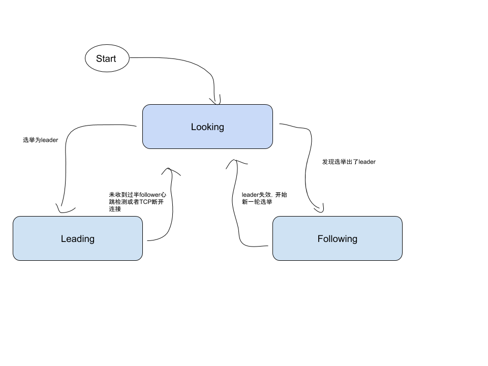
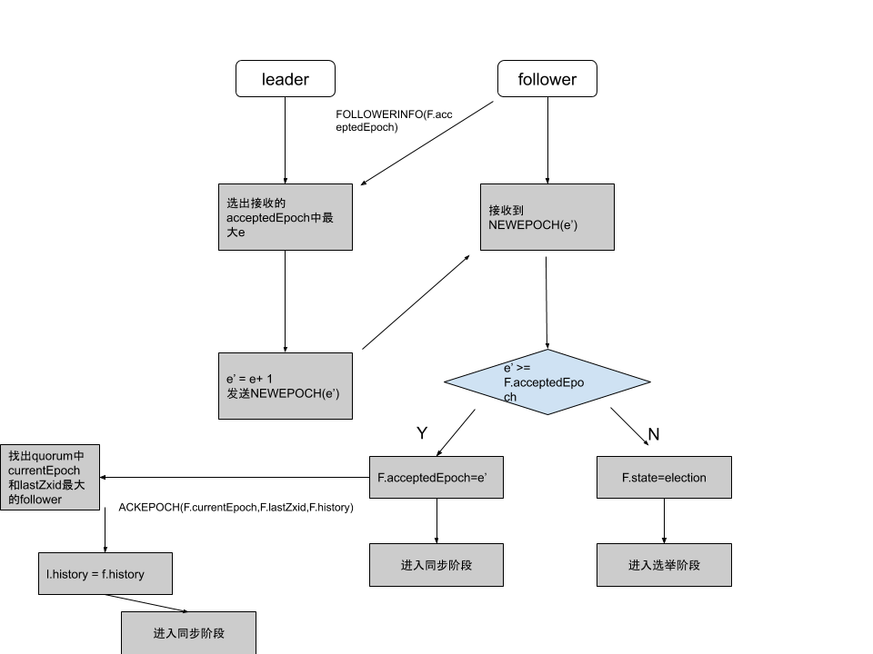

# ZAB 协议

## 前言

ZAB 协议是分布式协调服务 Zookeeper 专门设计的一种支持崩溃恢复的原子广播协议。在 Zookeeper 中，主要依赖 ZAB 协议来实现分布式数据的一致性。基于该协议，Zookeeper 实现了一种主备模式的系统架构来保持集群中各个副本的数据一致性。

## Zookeeper Atomic Broadcast protocol

ZAB 协议中，Z 表示 Zookeeper， A 表示 Atomic，B 表示 Broadcast，所以中文名是 Zookeeper 原子广播协议。

### 问题的提出

Zookeeper 客户端会随机连接到 Zookeeper 集群的一个节点，如果是读请求，就直接从当前节点中读取数据；如果是写请求，那么节点就会向 leader 提交事务，leader 会广播事务，只要有超过半数节点写入成功，该写请求就会被提交（类 2PC 协议）。

这样的场景就会引起几个问题：

- 主从架构，leader 崩溃，follower 的数据一致性怎么保证？
- 选举过程中，leader 暂时不可用，写请求无法处理，如何快速的进行 leader 的选举呢？

于是 ZAB 协议就是为了解决这些问题。

### 常用术语

- quorum：集群中超过半数的节点的集合

ZAB 中节点的三个状态：

- looking/election：选举状态，当前集群没有 leader 的产生
- leading：当前节点是 leader，负责协调事务
- following：当前节点是 follower，负责执行 leader 的命令。

代码里面多了一种叫：`observing` 的状态，这是 Zk 在引入 `observer` 之后加入的，Observer 不参与选举，是只读的节点，和 ZAB 没有关系。

集群中有三种角色：

- leader：也就是我们说的主
- follower：从
- Observer：观察者，不参与投票，只负责从主同步最新消息和读

节点持久数据的状态：

- history：当前节点接收到事务提议的log
- acceptedEpoch：follower 已经接受的 leader 更改年号的 NEWEPOCH 提议
- currentEpoch：当前所处的年代
- lastZxid：history 中最近接收到的提议的 zxid（最大的）。

> **Note** \
> 在 ZAB 协议的事务编号 Zxid 设计中，Zxid 是一个64位的数字，其中低32位是一个简单的单调递增的计数器，针对客户端的每一个事务请求，计数器加1；而高32位表示leader周期Epoch的编号，每次选举产生一个leader的时候，就会从这个leader的服务器上取出本地日志最大的zxid，并从中读取Epoch的值，然后加1，以此作为新的Epoch，并将低32位从0开始计数。   
> epoch：可以理解为当前集群所处的年代或者周期，每个 leader 就像皇帝，都有自己的年号，所以每次改朝换代，leader 变更之后，都会在前一个年代的基础上加 1。这样就算旧的 leader 崩溃恢复之后，也没有人听他的了，因为 follower 只听从当前年代的 leader 的命令。

### 四个阶段

ZAB 协议定义了 **选举(election)**、**发现(discovery)**、**同步(sync)**、**广播(Broadcast)** 四个阶段。

**一、选举阶段**

节点一开始都处于选举阶段(looking)，当某个节点能收到超过半数以上的节点的投票时，那么这个节点就会变成准 leader，该节点暂不会作为Leader节点来提供服务，能否真正作为Leader节点，还依赖与后续的阶段能否正常完成。

在整个 Zk 的生命周期中，每个节点其实都是在 **looking** 、**leading**、**following** 状态中不断轮换。

**二、发现阶段**

在选举出准leader之后，集群进入发现阶段。follower 和 准 leader 通信，同步 follower 最近接收的事务提议。这一个阶段的主要目的是发现当前大多数节点接收的最新提议，并且准leader生成新的Epoch，让follower接收，并且更新他们的 acceptedEpoch。

一个 follower 只会连接一个 leader，如果有一个节点 f 认为另外一个节点 p 是 leader，f 在尝试连接 p 时会被拒绝，f 被拒绝之后，就会进入 Phase 0。

**三、同步阶段**

同步阶段主要是利用 leader 前一阶段获得的最新提议历史，同步集群中所有的副本。只有当 quorum 都同步完成，准 leader 才会成为真正的 leader。follower 只会接收 zxid 比自己的 lastZxid 大的提议。

**四、广播阶段**

到了这个阶段，Zookeeper 集群才能正式对外提供事务服务，并且 leader 可以进行消息广播。同时如果有新的节点加入，还需要对新节点进行同步。

值得注意的是，ZAB 提交事务并不像 2PC 一样需要全部 follower 都 ACK，只需要得到 quorum （超过半数的节点）的 ACK 就可以了。