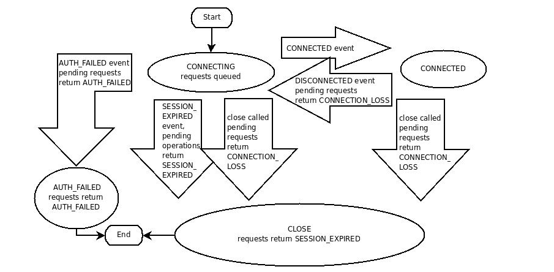

# Zookeeper 开发指南

这篇文件，会讲解Zk独立模式、复制模式、概念，目录：

[Zk 单节点搭建](#zk-单节点搭建)

[Zookeeper 概念](#zookeeper-概念)

## Zk 单节点搭建

### 下载

[点击前往下载地址](https://www.apache.org/dyn/closer.cgi/zookeeper/), Zk的启动依赖Java环境，并且必须是Java1.7及以上([点击去下载jdk](https://www.oracle.com/technetwork/java/javase/downloads/index.html))。

下载好Zk的压缩包之后，进行解压:

```shell
$ sudo tar -zxvf path/zk.tar.gz -C /usr/local/zookeeper
```

设置环境变量:

```shell
$ sudo vim /etc/profile

export ZKHOME=/usr/local/zookeeper
export PATH=${PATH}:${ZKHOME}/bin

$ sudo source /etc/profile
```

测试一下:

```shell
zkServer.sh status

ZooKeeper JMX enabled by default
Using config: /usr/local/zookeeper/bin/../conf/zoo.cfg
Error contacting service. It is probably not running.
```

如果是出现的类似上面的输出，则可以继续往下看。(切换到root)

### 单节点运行

一个节点的Zk适合开发使用，对于生产，推荐使用的是奇数个节点，并且最少3个。

启动Zk，我们需要一份配置文件，运行：

```shell
vim /usr/local/zookeeper/config/zoo.cfg

tickTime=2000
dataDir=/var/lib/zookeeper
clientPort=2181
```

文件名是可以叫任何名字的，但是在这里先不讨论，请命名为: `zoo.cfg`。我们来解释一下这几个参数的意思:

- tickTime: Zk的时间单位为毫秒(ms), 用于心跳检测，最小的会话超时时间是两倍心跳时间。
- dataDir: 存储内存数据库快照的位置，除非有别的说明，否则为更新数据库的事务日志。
- clientPort: Zk监听客户端连接的端口。

创建完配置文件之后，就可以启动单节点的Zk服务了:

```shell
zkServer.sh start

ZooKeeper JMX enabled by default
Using config: /usr/local/zookeeper/bin/../conf/zoo.cfg
Starting zookeeper ... STARTED
```

查看状态:

```shell
zkServer.sh status

ZooKeeper JMX enabled by default
Using config: /usr/local/zookeeper/bin/../conf/zoo.cfg
Mode: standalon
```

可以看到，现在zk是处于 单节点的模式(Mode:standalon)。当然，独立模式适合绝大部分开发测试使用，但是如果要运行在生产环境，必须要在外部去管理Zk的存储(`dataDir`和`logs`)。

### 连接到Zookeeper

连接Zk:

```shell
zkCli.sh -server localhost:2181
```

如果连接成功，那么你应该进入Zk的命令行界面。

在shell中，随便输入一个错误的命令可以获取客户端可执行的命令列表:

```shell
help 

ZooKeeper -server host:port cmd args
	addauth scheme auth
	close 
	config [-c] [-w] [-s]
	connect host:port
	create [-s] [-e] [-c] [-t ttl] path [data] [acl]
	delete [-v version] path
	deleteall path
	delquota [-n|-b] path
	get [-s] [-w] path
	getAcl [-s] path
	history 
	listquota path
	ls [-s] [-w] [-R] path
	ls2 path [watch]
	printwatches on|off
	quit 
	reconfig [-s] [-v version] [[-file path] | [-members serverID=host:port1:port2;port3[,...]*]] | [-add serverId=host:port1:port2;port3[,...]]* [-remove serverId[,...]*]
	redo cmdno
	removewatches path [-c|-d|-a] [-l]
	rmr path
	set [-s] [-v version] path data
	setAcl [-s] [-v version] [-R] path acl
	setquota -n|-b val path
	stat [-w] path
	sync path

```

我们进行一些简单的尝试来感觉这个命令界面，首先从list开始，查看当前Zk的存储节点：

```shell
ls /

[zookeeper]
```
这说明在根节点上存在一个子节点，子节点的名字叫 `zookeeper`；接下来我们创建一个叫 `zk_test`的节点，并且携带数据`my_data`:

```shell
create /zk_test my_data

Created /zk_test

# 注意，所有的节点必须是以根(/)开始，如果创建znode的时候，没有携带/，则报错，比如

create zk_test my_data

Command failed: java.lang.IllegalArgumentException: Path must start with / character
```

再发出一个 `ls /` 命令看看发生了什么：

```shell
ls /

[zookeeper, zk_test]
```

请注意，现在已经创建了 `zk_test` 节点。

接下来，我们使用 `get` 命令去验证刚刚创建znode时携带的数据是否和znode关联:

```shell
get /zk_test -s

my_data
cZxid = 0x4
ctime = Tue Aug 20 15:48:02 CST 2019
mZxid = 0x4
mtime = Tue Aug 20 15:48:02 CST 2019
pZxid = 0x4
cversion = 0
dataVersion = 0
aclVersion = 0
ephemeralOwner = 0x0
dataLength = 7
numChildren = 0
```

我们还可以使用 `set` 更改这个znode的数据：

```shell
set /zk_test my_data_change

get /zk_test -s

my_data_change
cZxid = 0x4
ctime = Tue Aug 20 15:48:02 CST 2019
mZxid = 0x5
mtime = Tue Aug 20 16:02:16 CST 2019
pZxid = 0x4
cversion = 0
dataVersion = 1
aclVersion = 0
ephemeralOwner = 0x0
dataLength = 14
numChildren = 0

```

那么，经过一些简单的感受，我们是成功的启动一个单实例Zk。但是我们先不急着讲复制模式。我们先来了解Zk的一些概念。

## Zookeeper 概念

[Zookeeper的数据模型](#zookeeper的数据模型)

[Znodes](#znodes)

[Zookeeper中的时间](#zookeeper中的时间)

[ZooKeeper Stat Structure](#zooKeeper-stat-structure)

[ZooKeeper Session](#zookeeper-session)

[ZooKeeper 监听器](#zk监听器)

### Zookeeper的数据模型

Zk是有一个有层级的命名空间，就比如分布式文件系统。唯一有区别的就是命名空间的每一个节点都可以包含与之关联的数据和子节点。这就像拥有一个文件也是目录的文件系统。节点的路径始终是绝对路径，并且以斜杠(/)分隔，相关路径和引用Zk将无法识别。除了以下的约束，任何Unicode字符都可以用在路径中:

1. `null`字符(\u0000)不能成为路径名字的一部分(会导致C的绑定出现问题)
2. 下面几个字符不能使用，因为他们有时候会以一种令人很困惑的方式显示: \u0001 - \u001F and \u007F
3. \u009F
4. 下面的字符不允许:  \ud800 - uF8FF, \uFFF0 - uFFFF
5. 字符"."可以做为路径名字组成的一部分，但是不能单独使用"."或者".."表示路径的节点，比如/a/b/./c是无效的，/a/b/.c是有效的
6. `zookeeper` 是保留字，/zookeeper默认已经存在了。

### Znodes

Zookeeper树中的每个节点都叫Znode。Znodes维护一个stat结构，这个stat结构包含了数据更改的版本号、ACL的变化、时间戳。版本号和时间戳共同作用使Zk可以验证缓存和协调更新，每一次节点数据变化，版本号都会加1，比如，任何时候一个客户端从Zk取数据，同时也会拿到这个数据的版本，当客户端想要对这个节点执行更新数据或者删除的时候，客户端必须提供它正在改变的znode的数据的版本，如果提供的版本和数据的实际版本不一致，则更新会失败（当然，我们也可以覆盖版本）。

**Note**

> 在分布式系统中，node 可以指通用主机、服务器、集合成员、客户端进程等等，但是在Zk中，znode指的是数据节点，Servers才是构成Zk服务的主机，client指的是使用Zk服务的任何主机或者进程。

znode是开发人员访问的最主要的功能，它有几个值得一提的特征:

#### Watches

客户端可以在znodes上设置监听，改变znode会触发监听机制并移除该监听，当监听触发时，Zk会给客户端发送一个通知。更多信息在[Zk Watches](#zk监听器)。

#### 数据访问(Data Access)

在一个命名空间的每个znode的数据存储不管是写入还是读取都是原子的。读取的时候，获取znode的所有数据，写入的时候，替换znode的所有数据。每个节点都有一个准入控制列表(ACL: Access Control List)控制谁可以做什么。

ZK并非设计为通用数据库或者大对象存储服务。相反，它管理协调数据，数据可以是配置、状态信息、集合点等形式。各种各样的数据有一个共同的属性就是他们都很小：以千字节为标准(1M,强制性)。Zookeeper客户端和服务端实现了健康检查确保znode数据小于1M，但是数据应该远低于平均数据。操作较大的数据将导致一些操作花费更多的时间，并且会影响一些操作的延迟，因为在网络和存储媒介中移动更多的数据将需要额外的时间。如果需要存储大数据，通常的处理是把数据存储在一个大容量存储系统中，并把存储位置的指针存储到ZooKeeper上。

#### 临时节点(Ephemeral Nodes)

ZooKeeper也临时节点的概念。这些znodes存活的时间和创建这个节点的会话有效期是一样的。当会话结束，节点被删除。因为这种临时节点的特性，临时节点不允许有子节点

#### 顺序节点-命名唯一(Sequence Nodes -- Unique Naming)

当创建一个节点的时候，也可以请求ZooKeeper在路径后面增加一个自增的计数器。对父节点来说，这个计数器是 唯一的。计数器是%010d的格式——是一个十位数，比如：<path>0000000001。

注意：这个计数器用来存储下一个序列号的是一个四字节的数，当增加到2147483647后，计数器将会溢出(结果是"-2147483648")。

#### 容器节点(Container Nodes)

**Added in 3.5.3**

容器节点是为leader、lock等操作存在的，当容器节点的最后一个孩子节点被删除之后，容器节点将被标注并在一段时间后删除。 
由于容器节点的该特性，当你在容器节点下创建一个孩子节点时，应该始终准备捕获KeeperException.NoNodeException，如果捕获了该异常，则需要重新创建容器节点。

#### TTL 节点

**Added in 3.5.3**

当创建永久节点或者永久顺序节点的时候，可以为znode设置ttl(单位:ms)，在ttl时间内如果没有更改znode并且该znode没有子节点，则服务端在未来某个时间将删除这个znode。

### Zookeeper中的时间

Zk有多种方式跟踪时间:

#### Zxid

Zookeeper每次改变状态都会接受一个`zxid`(Zookeeper Transaction Id)形式的标记，他暴露了Zk的所有变化的顺序，每次变更都会生成唯一的zxid，如果zxid1小于zxid2则说明zxid1先于zxid2发生

#### Version numbers

节点的每次变化都会引起这个节点版本号之一的一次增加。这三个版本号是：version（一个节点的数据变化次数），cversion（一个节点的子节点变化次数），aversion（一个节点的ACL 变化次数）。

#### Tricks

当使用多个ZooKeeper服务，服务器使用ticks来确定事件的时间，比如说状态上传、会话超时、连接超时等。这个tick时间仅仅通过最小会话超时时间间接的暴露出来；如果一个客户端请求会话的超时时间小于最小超时时间，服务器将会告诉客户端实际的会话超时时间是最小超时时间。

#### real time

ZooKeeper不使用实时、时钟时间。除了把时间戳放在stat结构中。

### ZooKeeper Stat Structure

Zk中每个znode的Stat结构由以下字段组成:

- **czxid**: 该节点被创建时候的事务ID
- **mzxid**: 该节点最后被修改时候的事务ID
- **pzxid**: 该节点的子节点最后被修改时候的事务ID
- **ctime**: 该节点被创建的时间
- **mtime**: 该节点最后被修改的时间
- **version**: znode数据的版本号,即变化次数(dataVersion)
- **cversion**: 该节点的子节点变化次数
- **aversion**: 该节点ACL改变次数(aclVersion)
- **ephemeralOwner**: 如果该节点是临时节点，则表示创建该节点的会话id，否则是0
- **dataLength**: 这个节点的数据长度
- **numChildren**: 该节点的子节点个数

### Zookeeper Session

通过使用一种语言绑定来创建服务端的句柄，一个ZooKeeper客户端可以和ZooKeeper服务创建会话。一旦创建，句柄开始在CONNECTING 状态，客户端库尝试连接组成ZooKeeper服务中的其中一个服务器并且切换到CONNECTED状态。在正常的操作期间将会是这两种状态之一。如果一个不可恢复的错误发生了，比如说会话过期或授权失败，或者如果应用显示地关闭了句柄，句柄将会到CLOSED状态。下面的图展示了一个ZooKeeper客户端可能的状态转变。



为了创建一个客户端会话，应用程序代码应该提供一串以逗号分隔的，并且主机号和端口号成对出现的字符串，每个都相当于一个Zk服务(列如: "localhost:2181" 或者 "localhost:2181,192.168.2.210:2181,192.168.2.75:2181")。Zk客户端会任意选择一个服务器并尝试连接他，如果连接失败，或者客户端由于某些原因从服务器断开连接，客户端将自动尝试列表中的下一个服务器，直到一个连接建立。

**Added in 3.2.0**: "chroot"后缀可以被加在连接字符串后面，这会运行客户端命令导致所有的路径都和这个跟路径相关。如果使用像下面的示例：”127.0.0.1:4545/app/a或 “127.0.0.1:3000,127.0.0.1:3001,127.0.0.1:3002/app/a” ，客户端将把”/app/a”作为跟路径，并且所有的路径都与这个根路径相关，比如getting、setting等。”/foo/bar” 将导致操作在”/app/a/foo/bar”（从服务端的观点来看）。这个特性在多租户下面是非常也有用的，ZooKeeper服务的每个用户可以有不同的根路径。这让再使用变得非常简单，因为每个用户都可以编写代码让他的应用好像在”/”根路径下，但实际的位置能在部署时决定。

当一个客户端从ZooKeeper服务得到一个句柄，ZooKeeper创建了一个会话，表现为一个64位的数字，并把 它分配给客户端。如果客户端连接到一个不同的服务端，在连接握手的时候它将发送这个会话id。作为一个安全措施，服务端给会话id创建了一个密码，让服务端能够校验。当客户端建立会话的时候，这个密码随着会话id一起发送给客户端。每当客户端与一个新的服务端恢复会话的时候，密码会随着会话id一起发送过去。

客户端调用创建会话的时候有一个参数是会话超时时间（毫秒），客户端发送一个要求的超时时间，服务端回复一个他能给客户端的超时时间。当前实现要求超时时间至少是2倍的tickTime(在服务器配置中设置)，最大是20倍的tickTime。ZooKeeper客户端API允许使用一个协商的超时时间。

当一个客户端从ZK服务集群成为分区，它将开始寻找在会话创建时期指定的服务端列表。最终，当客户端和至少一个服务端联通重新建立的时候，会话要么转变成“connected”状态（如果在会话超时时间内恢复连接），要么转变成“expired”状态（如果在超时时间之外恢复连接）。在断开时创建一个新的会话是不可取的。ZK客户端库将处理连接。尤其是客户端内部有方法来处理像“羊群效应”之类的事情。仅仅在你被通知会话过期的时候去创建一个新的会话。

ZooKeeper集群自己管理会话过期，而不是由客户端管理。当ZK客户端和一个集群建立会话，它提供一个“超时时间”。这个值被集群使用来决定客户端的会话是否过期。当集群不能在指定的会话超时时间内从客户端收到信息，过期发生。在会话过期期间，集群将删除由这个会话创建的所有的临时节点，并且立即通知连接的客户端这个改变。此时，会话过期的客户端依然和集群式断开的，它不会收到通知直到它能和集群重新建立连接。这个客户端将保持断开状态直到和集群的TCP连接重新建立，并且在这个时候，过期会话的监听将会收到“会话过期”通知。

对于一个过期的会话，监听器所看到的状态转变：

1. “connected”：会话建立，并且客户端和集群能够交流
2. ...客户端从集群被分割
3. “disconnected”：客户端和集群断开连接
4. ...时间流逝，在超时时间之后，集群已经让这个会话过期，而客户端并不知道，因为它已经和集群断开连接了
5. ...时间流逝，客户端和集群重新建立连接，并且能和集群通信
6. “expired”：客户端将收到会话过期的信息

ZooKeeper会话建立的另一个参数是默认监听器。当客户端的一些状态改变发生，监听器会收到通知。比如如果客户端丢失与服务端的连接，客户端将会收到通知，或客户端的会话到期等。这个监听器应该考虑初始状态到断开连接。对于一个新的连接，第一给发给监听器的事件就是会话连接事件。

客户端通过发送请求保持会话存活。如果会话在一段时间内空闲将会导致会话超时，客户端将会发送PING请求保持会话存活。这个PING请求不仅仅让ZooKeeper服务端知道客户端是存活的，而且让客户端检查它的和ZooKeeper 服务端的连接也是存活的。PING的时间是足够保守的合理时间，来发现死掉的连接和一个新的服务端重新连接。

一旦成功建立一个到服务端的连接，当客户端发生connectionloss异常 时有两种基本的情况，在执行一个同步或者非同步的操作时：

1. 应用调用一个操作，但是会话不再存活。

2. 当等待一个操作的时候ZooKeeper客户端从服务端断开连接，比如说：等待一个异步调用。

**Added in 3.2.0-SessionMovedException**: 有一个内部的异常，通常不会被客户端发现，被称为SessionMovedException。一个已经连接的会话但是重新连接到了一个不同的服务器上接收了一个请求，这个异常就会发生。这个错误的正常原因是一个客户端发送了一个请求到一个服务端，但是网络数据包延迟了，所以客户端超时并连接到了一个新的服务器。当延迟的数据包到达了第一个服务器，这个服务端发现这个会话已经被移除了并且关闭了这个客户端连接。客户端一般不会发现这个错误因为它们不在从老的连接读取数据（老的连接一般被关闭了）。这种事情发生的另一种情况是当两个客户端使用一个保存的会话id和密码来尝试恢复相同的连接时，只有一个客户端能够恢复连接，另一个客户端将会断开。

**更新服务器列表**: 我们允许一个客户端更新连接字符串通过提供一个新的逗号分隔的主机：端口号列表，每个都是一个服务器。函数调用一个概率负载均衡算法会引起客户端断开与当前主机的连接，来使在新列表中的每个服务器达到与预期一致的数量。万一客户端连接的当前主机不在新的列表中，这个调用会引起连接被删除。另外，这个决定基于是否服务器的数量增加或减少了多少。

比如说，如果之前的连接包含三个主机，现在的连接多了两个主机，连接到每个主机的客户端的40%为了负载均衡将会移动到新的主机上去。这个算法会引起客户端断掉它当前与服务器的连接，这个概览是0.4，并且客户端随机选择两个新主机中的一个连接。

另一个例子，假设我们有5个主机，然后现在更新列表移除两个主机，连接到剩余三台主机的客户端依然保持连接，然而所有连接到已被移除主机的客户端都需要移到剩下三台主机的一台上，并且这种选择是随机的。如果连接断开，客户端进入一个特殊的模式并使用概率算法选择一个新的服务器，而不仅仅只是循环。

在第一个例子中，每个客户端决定断开连接的概率为0.4，但是一旦做了决定，它将会随机的连接到一个新的服务器，仅仅当它不能连接到任何一台新的服务器上时，它将尝试连接旧的服务器。当找到一个服务器或者新列表中所有的服务器都连接失败的时候，客户端回到操作正常模式，选择一个任意的服务器并尝试连接它，如果连接失败，它会继续尝试不同的随机的服务器，并一直循环下去。

### Zk监听器

ZooKeeper中所有的读操作——getData(), getChildren()和 exists() — 可以选择设置 一个监听器。这是ZooKeeper’s一个监听器的定义：一个监听事件是一次性触发，当一个被设置监听的数据改变时，发送给设置这个监听器的客户端。在这个监听器的定义中，有三个要点：

- 一次性触发：当数据改变的时候一个监听事件会被发送给客户端。比如说，如果一个客户端做了getData(“/znode1″, true)操作，然后 /znode1下的数据被改变或者删除了，客户端将得到/znode1的一个监听事件。如果/znode1节点再次发生改变，没有监听事件会被发送除非客户端做了别的设置了一个新的监听器。

- 